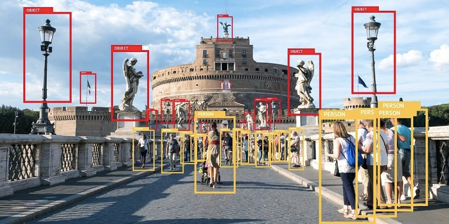

# Yolo v3

## 1. 개요

---

그림 1: [https://user-images.githubusercontent.com/13328380/49785835-250e0480-fd65-11e8-87b9-fd74459ade47.jpg](https://user-images.githubusercontent.com/13328380/49785835-250e0480-fd65-11e8-87b9-fd74459ade47.jpg)

**객체 탐지(Object Detection)**란 *그림 1*과 같이 이미지 상에 있는 물체를 인식하는 것을 말한다. 객체 탐지는 총 2개의 작업을 동시에 하는 것인데, 하나는 이미지 안에 있는 한 물체를 **분류(Classification)**하는 것이고, 다른 하나는 이미지 안에 물체가 어디있는지 **위치 정보를 알아내는(Localization)** 것이다. *그림 1*에는 많은 사람과 조각상 들이 있는데, 그들의 위치와 종류를 서로 다른 색깔의 박스로 표현한 것을 볼 수 있다.

이 객체 탐지는 과거부터 많이 연구가 진행되던 분야로, 초기에는 고전적인 컴퓨터 비전(Computer Vision) 기반으로 연구 및 구현이 진행되었다. (대표적인 예로 HOG(Histograms of Oriented Gradients)와 같은 알고리즘이 있다.) 하지만 그 이후에 사용할 수 있는 데이터 양이 증가하고 컴퓨팅 성능이 향상되면서 **딥러닝 기반의 이미지 인식 알고리즘(CNN기반)** 이 나오게 되었고, 고전적인 방법과 비교했을 때 월등히 좋은 성능을 보여주어 최근에는 딥러닝 기반으로 계속해서 많은 연구가 진행되고 있다.

그림 2: [https://pjreddie.com/darknet/yolo/](https://pjreddie.com/darknet/yolo/)

Yolo는 위에서 볼 수 있듯이 You only look once의 줄인말이다. Yolo가 나오기 전에 개발되었던 Object detector들은 모두 Two-Stage Detector로, 아래 *그림3*에서 볼 수 있듯이 두 단계를 거쳐서 최종적인 결과가 나오는 구조를 가지고 있다. 반면 Yolo는 **One-Stage Detector**로 한번의 단계로 최종 결과를 만들어 내는 것이다. 이를 통해 성능 향상을 이루었고, Real-time으로 물체들을 인식 할 수 있다.

그림 3: [https://blog.kakaocdn.net/dn/6590G/btqCWbQVnkx/grxthKJ38iTwEIpqdX2TWk/img.png](https://blog.kakaocdn.net/dn/6590G/btqCWbQVnkx/grxthKJ38iTwEIpqdX2TWk/img.png)

자율주행 자동차가 안전하고 정확하게 주행하기 위해서는 실시간성이 굉장히 중요하다. 자율주행 자동차는 객체를 인식해서 상황에 맞는 주행을 해야 하는데, 대부분의 Object Detector들은 fps가 10-20 정도로 실시간성이 굉장히 떨어진다. 하지만 Yolo는 비교적 높은 인식률을 보여주면서 최소 30fps 정도의 성능을 보여주기 때문에 자율주행 인지에서 사용하기 적합한 모델이라고 할 수 있다. 

Yolo는 초기 버전인 v1부터 최근 비공식적으로 v5까지 나온 상태다. 이들 중 이전 버전보다 성능 향상을 이루었으며, 공식적으로 인정받은 v3를 살펴볼 예정이다. 아래는 다른 one-stage detector인 RetinaNet과의 성능을 비교한 그래프이다.

그림 4: [https://arxiv.org/pdf/1804.02767.pdf](https://arxiv.org/pdf/1804.02767.pdf)

원래 Yolo는 Darknet 기반으로 구현이 되어있지만, 여기서는 Yolo를 Pytorch로 코드가 구현되어 있다.

## 2 구성

---

내가 사용한 프로젝트 코드의 구성을 알아보고, Yolo 모델 구성에 대해 알아보았다.

### 2.1 소스코드 구성

대략적인 소스코드 구성은 아래와 같은 트리구조로 되어있다.

- **train.py**: 모델 학습(train) 로직 구현
- **test.py**: 모델 평가(evaluation) 로직 구현
- **detect.py**: 학습 된 모델로 inference 진행
- **models.py**: 딥러닝 네트워크 모델 구현
- **utils**: train/evaluation 과정에서 필요한 여러 모듈들을 담은 폴더
    - **augmentations.py**: 데이터 augmentation 구현 (imgaug 모듈 사용)
    - **datasets.py**: 데이터셋 처리 함수, loader 구현
    - **logger.py**: logger 구현
    - **loss.py**: iou 계산 함수, loss 계산 함수 구현
    - **parse_config.py**: model/data config file을 파싱하는 함수 구현
    - **transforms.py**: transform 로직 구현
    - **utils.py**: iou 계산, ap 계산, box rescale, nms 등 핵심 로직 구현
- **config**: 모델과 학습 관련된 파라미터, 정보들을 담은 폴더
    - **coco.data**: 결과 class 개수, train/valid path를 담은 파일 경로, class 이름을 담은 파일 경로를 정하는 셋팅 파일
    - **yolov3.cfg**: 학습 관련된 hyperparameter들, 각 layer의 hyperparameter 관련된 셋팅 파일
- **data**: train/evaluation 을 위한 데이터를 관리하는 폴더

### 2.2 모델 구성

Yolo v3는 Yolo v1 모델에 성능 향상을 위해 특정 부분을 수정한 것이다. 핵심 모델 형태와 방법론은 동일하므로, 여기서는 모델 구성을 Yolo v1 paper 기준으로 이해해 보려고 한다.

그림 5: [https://arxiv.org/pdf/1506.02640.pdf](https://arxiv.org/pdf/1506.02640.pdf)

Yolo는 이전에 나왔던 다른 object detection 모델과 가장 큰 차이점은 한번에 classification과 localization을 한다는데 있다. *그림 5*에 나와있듯이 Yolo는 이미지를 SxS로 나누고 그 안에서 `Bounding box + Confidence value` 와 `Class probability` 를 구해서 최종적인 객체들을 인식하게 되는데, 중요한 것은 이 두개의 결과가 하나의 네트워크의 output으로 나온다는데 있다.

그림 6: [https://arxiv.org/pdf/1506.02640.pdf](https://arxiv.org/pdf/1506.02640.pdf)

*그림 6*에 나와있는 구조가 Yolo 네트워크 구조이다. 24개의 Conv layer 로 되어있으며, 2개의 FCN으로 되어있어 최종적인 output은 7x7x30크기의 tensor로 되어있다. 이 output tensor를 아래에서 조금 더 자세히 살펴보자

그림 7: [https://miro.medium.com/max/1406/1*YG6heD55fEmZeUKRSlsqlA.png](https://miro.medium.com/max/1406/1*YG6heD55fEmZeUKRSlsqlA.png)

*그림 7*을 보면 output tensor (7x7x30) 중 1-5번째 채널까지는 첫번째 bounding box에 대한 정보(confidence, x, y, width, height)를 담고 있고 6-10번째 채널에서는 두번째 bounding box 정보를 가지고 있다. 나머지 11-30 번째 채널에서는 각 class에 대한 probability를 담고있는데, 즉 1-10번째 채널까지가 위에서 설명한 `Boundng box + Confidence` 에 해당되며 11-30번째 채널까지가 `Class probability` 에 해당한다.

정리하면, Yolo는 네트워크 하나로 Classification과 Localization을 동시에 수행하는 모델이며, 이러한 방식으로 실시간성을 보장할 수 있다.

## 3 활용 및 결과

---

[https://neilyongyangnie.files.wordpress.com/2018/11/0_hmacefect2pyqoxf.jpg?w=1280](https://neilyongyangnie.files.wordpress.com/2018/11/0_hmacefect2pyqoxf.jpg?w=1280)

Yolo는 real-time object detection인 만큼 실시간성이 뛰어나 자율주행에서 사용하기에 적합하다. 자율주행을 하다보면 **전방 차량, 표지판, 신호등, 보행자** 등 인식해야 할 객체들이 많은데, 그 객체들을 카메라와 Yolo 알고리즘을 통해 인식할 수 있다. 전방 차량을 인식하여 앞 차간 거리를 유지할 수 있으며, 표지판을 인식하여 주행 정보를 얻을 수 있고, 신호등을 인식하여 교통 법규를 지키며 주행할 수 있다. 또한 보행자나 다른 물체가 차량 경로상에 갑자기 들어오는 경우 위험 상황도 판단하여 대처할 수 있을 것이다.
